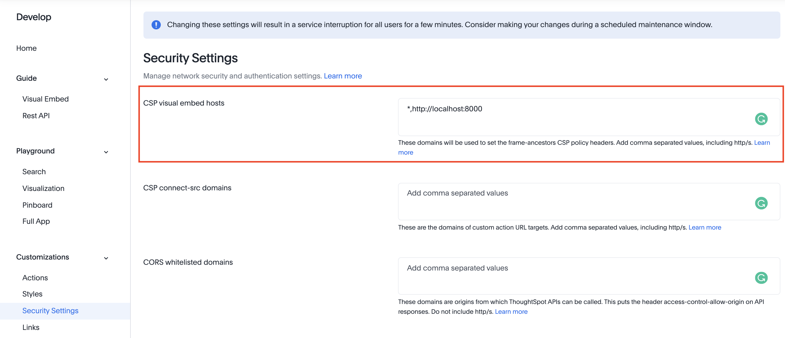

# Example custom actions

The files in these sections contain different examples of using custom actions.  These examples are intended to demonstrate some concept and will need to be modified some for your own environment.  As examples, error handling and such are not usually included.

Each folder has the following files: 
* a README that describes the custom action and how to use it
* a tse.js file with the custom action implemented.  
  
These files are designed to be used with the embed_template files, replacing the tse.js that comes in that folder with the custom action.  Alternatively, you can simply take the relevant components to create a larger application.

## Testing an example action

If you want to just test an example action, you should follow these steps:

1. Create a new directory on your computer.
2. From the embed_template folder, download the index.html and tse.css files.
3. From the example folder, download the tse.js file.
4. Update the tse.js file to include your cluster specific settings, such as URL, pinboard IDs, etc.  The changes required will vary based on the example.
5. Run locally using a web servers, such as `python3 -m http.server <por>`.

Some examples also require the dataclasses.js or rest-api.js files from the apis folder.  Those scenarios will be listed in the README for that particular examples.

## Security Requirements

To run any example, you will need to have your server set in the CSP Visual Embed Hosts section of the Develop Security settings as shown below.  This setting will not allow you to make REST calls (such as login), so you should use `AuthType.None` as shown in the examples.  See the [ThoughtSpot documentation](https://cloud-docs.thoughtspot.com/admin/ts-cloud/security-settings.html) for additional information about security settings.

