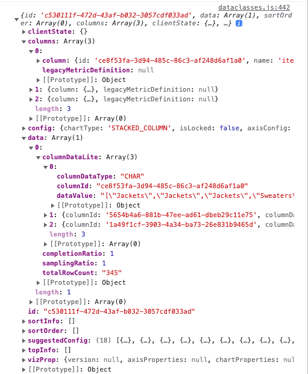
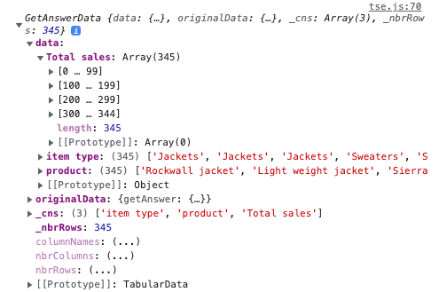
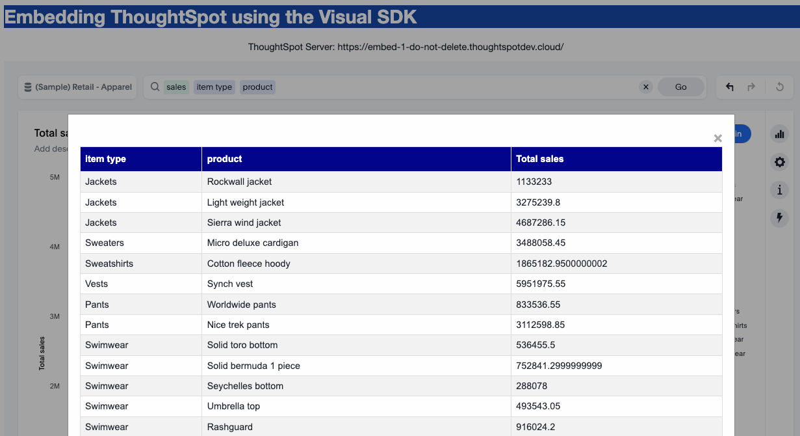

# Fetch Data

Sometimes you want to be able to get all the data underlying a search when a custom action is triggered.  There is a feature that allows you to call back and get the data for the search without doing a query.  This example shows how to implement that capability.  It uses the `dataclasses.js` file to simplify the handling of the data.

# Embed the content

## index.html

In `index.html` you'll note two important `
` is for a modal dialog where the results will be displayed.  

~~~

  

    &times;
    <pre id="modal-data-content"></pre>

~~~

The `show-data` is the outer portion of the modal that controls hiding and display.  If you look at the `tse.css` you will see that the `modal` style is hidden by default.  The `modal-data-content` is where we will add content from the `fetchData` call.

## tse.js

The embedding code should look familiar if you have embedded a search.  There is an init, in this case using `AuthType.Basic` and then a `SearchEmbed` component to create the embedded search component.

Below is the full embed.  Note that your query might differ.  Note that there is a custom action handler.  In this case 
we don't care which one it is, but normally you'd probably check `payload.id`.  When the custom action is triggered it
calls `showData`, which is an asynchronous method.

~~~
  const embed = new SearchEmbed("#embed", {
    collapseDataSources: true,
    dataSources: ["cd252e5c-b552-49a8-821d-3eadaa049cca"],  // use correct GUID for a worksheet.
    searchOptions: {
      searchTokenString: '[sales] [item type] [product]',   // (optional) use a valid search.
      executeSearch: true,
    },
  });

  embed
  .on(EmbedEvent.CustomAction, async(payload)=> {
    showData(payload);
  })
  .render();
~~~

Then handler to show the data will use the `payload.answerService` to fetch the data for the search.   Note that this 
service is only available when using a custom action.  The `fetchData` call is asynchronous, so we're using `await` to
wait for the service to complete.  Then we'll get the answer data and log it (so you can see what it looks like) using
the `GetAnswerData` class in the `dataclasses.js` file (more below).  Then the data is converted to a table and
displayed in the modal box as a popup.  

~~~
async function showData (payload) {
    const offset = 0;
    const batchSize = -1;

    const fetchAnswerData = await payload.answerService.fetchData(offset, batchSize);
    const answerData = GetAnswerData.createFromJSON(fetchAnswerData);
    console.log(answerData);

    const table = tabularDataToHTML(answerData);
    document.getElementById("modal-data-content").innerHTML = table;
    document.getElementById("show-data").style.display = "block";
}
~~~

## dataclasses.js

The `dataclasses.js` file has been available for quite some time to make the handling of the various JSON formats 
easier instead of having to create your own parser.  The following image shows part of the returned object.  

`dataclasses.js` has a class called `GetAnswerData` that simplifies the data structure into a consistent, table-based structure.  

.  Additionally, there are helper functions to convert to tables, CSV, etc. In general, it's recommended you use these classes to speed development, but it's not required.  

# Results

The final result is a pop-up box that shows the data in the original request.  This allows you to make calls to other services, etc. with the full data load.

# Files

* `index.html` - primary application file into which ThoughtSpot will be embedded.
* `tse.js` - main functionality of the application
* `tse.css` - style sheet for the application
* `dataclasses.js` - contains data wrappers and helper functions for the JSON formats

