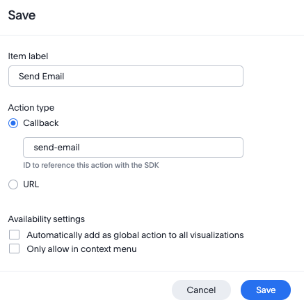
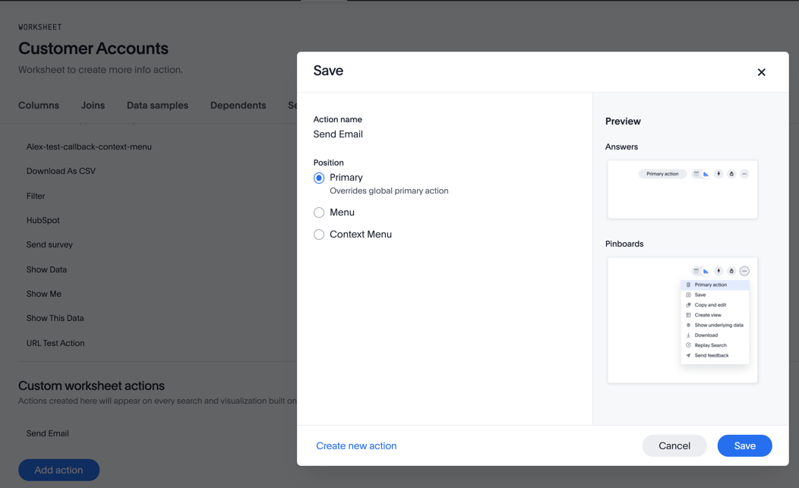
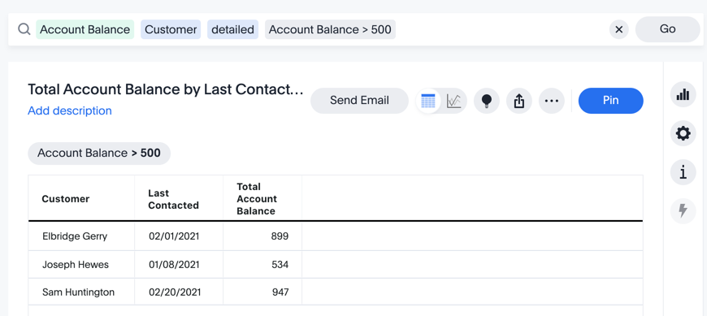
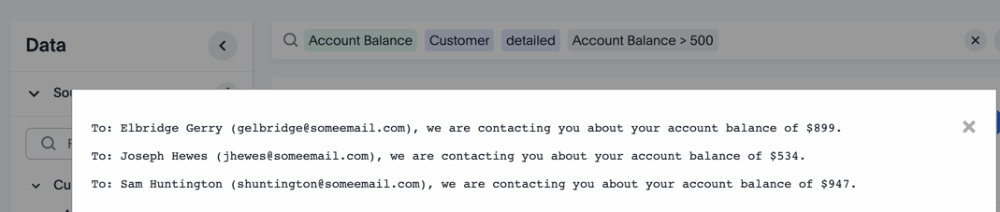

# Get More Info

This example shows the how to get more info when an action is triggered.  In this scenario we have customers with an account balance, date of last contact, and an email.  The user wants to find customers with balances in a certain range that haven't been contacted in more than three months and send them a standard email.

## Setup

For this example, you'll need custom action to send email.  The action is labeled as "Send Email" with an ID of 'send-email'.

In this case we aren't setting this as a global action so that we can control where it gets displayed.  

Next, set the custom action to be associated with the worksheet as the main menu item.  This setting will cause the action to show on any answer (including search) that uses this worksheet.  By setting it at the worksheet level, we know our calls to get additional information will work.  

## Create content

This example uses the following data format in a worksheet.

| Customer | Email | Account Balance | Last Contact Date |
|----------|-------|-----------------|-------------------|
| Josiah Bartlet | jbartlett@someemail.com | 370 | 5/22/21 |

This example uses Search, so no additional content is required. This example will
use a search like the following, but any search can work as long as it has the customer names (due to the restriction in the code below).  Notice the (Send Email) button in the display.

## Solution

The solution consists of two parts.  First, embed the search.  In this case the search has some pre-defined search tokens and runs automatically, but that's not required.  Second, handle the custom action to get more data and generate emails.  

### Embed the search

The following code shows the component for embedding the search.  The search component has a predefined search string and will automatically execute the search.  The wsGUID is the GUID for the worksheet being used as the data source.  

When the search object is rendered, an action handler is being added to handle the custom action.  In this case it will check to make sure this is the `send-email` action and then call a function to send the emails.

~~~
const onSearch = () => {
  const embed = new SearchEmbed("#embed", {
    frameParams: {},
    dataSources: [wsGUID],
        searchOptions: {
        searchTokenString: '[Account Balance] [Customer] [Last Contacted].detailed [Account Balance] > 500',
        executeSearch: true,
    },
  });

  embed
    .on(EmbedEvent.CustomAction, (payload) => {
      if (payload.data.id === 'send-email') {
        sendEmail(payload);
      }
    })
    .render();
}
~~~

### Send email

Once the user triggers the action to send the email, the following function is called with the following steps:

1. Verify that there is a customer, since that's going to be used to filter who to send the email to.  Note that future versions of custom actions will allow you to specify required columns, making this part optional.  
2. Assuming there are customers, generate a search to get the information needed for the emails, limiting to the list of customers in the search.  
3. Execute the search against the same worksheet to get the data needed.
4. For each of the customers send an email based on the data.  

Note that this code uses the dataclasses and the rest-api.js files to simplify the calls and data handling.

~~~
const sendEmail = (payload) => {
  const actionData = ActionData.createFromJSON(payload);

  // Verify the customer is in the data or give an error.
  if (! actionData.columnNames.includes("Customer")) {
    alert("The customers must be selected for this action");
  }
  else {
    // get the list of customers.
    const people = "'" + actionData.data['Customer'].join("' '") + "'";

    const search = `[Customer] [Account Balance] [Email] [Customer] in ([Customer] ${people})`;
    getSearchData(tsURL, wsGUID, search).then ((response) => {
      const searchData = SearchData.createFromJSON(response);

      const emails = [];
      for (let idx = 0; idx < searchData.nbrRows; idx++) {
        const customer = searchData.data['Customer'][idx];
        const email_addr = searchData.data['Email'][idx];
        const balance = searchData.data['Total Account Balance'][idx];

        const email = createEmailMessage(customer, email_addr, balance);
        emails.push(email);
      }
      showEmails(emails);
    });
  }
}
~~~

In this case, we aren't going to send emails, but rather just generate a simple email message and display what could have been sent.  The `createEmailMessage` generates a simple email, but could use a template for a more involved email.  The key is that it's a parameterized message with the data from our search.

The `showEmails` simply shows the emails in a popup.  

~~~
/** generate a super simple email message as an example. */
const createEmailMessage = (customer, email, balance) => {
  return `To: ${customer} (${email}), we are contacting you about your account balance of $${balance}.`
}

/** shows the email. */
const showEmails = (emails) => {
  const showDataElement = document.getElementById('modal-data-content');
  showDataElement.innerHTML = emails.join("\n\n");

  // display the model box.
  const dataElement = document.getElementById('show-data');
  dataElement.style.display = 'block';
}
~~~

Assuming all goes well, you will get something similar to the following:

