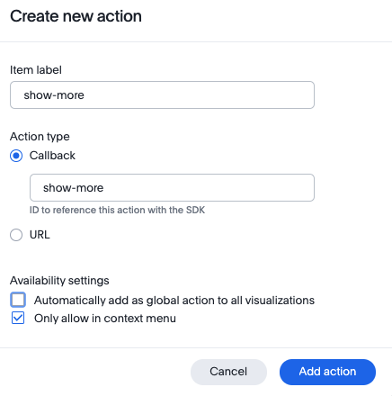
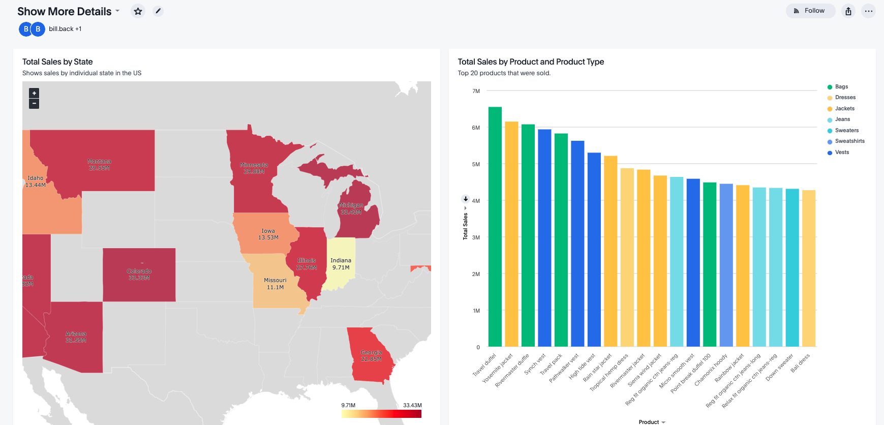
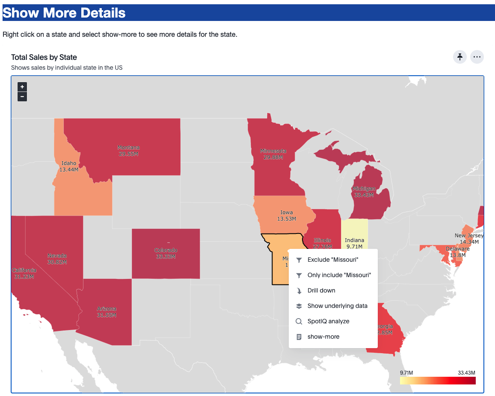
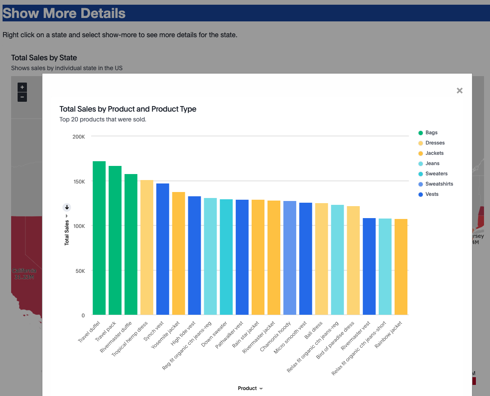

# Show More Details

This example shows how to use a custom action in a context menu to show a pre-defined answer with more details about the data point.  The main concept in this example, is that you don't have to do any custom creation of visualizations to get a nice detail view.  You can use ThoughtSpot to develop the visualizations and then the Visualization SDK to connect and display the visualizations. 

## Setup

For this example, you'll need a custom action to add to the pinboard.  In this example, the action is called 'show-more' and is configured as shown in the image.  This action is set to be on the context menu and not be added globally.

If you use a different id, you'll need to change the code:

`payload.id === 'show-more'`

## Create content

Create a pinboard to use for the main visualization and the details.  By creating them all in one pinboard, we're able to manage this as a single project and make sure the filters will all work.  You can extend this example to have multiple additional visualization that are used as details with other actions.

The following pinboard contains a map of US States with sales.  There is also a pin that shows top sales.  The map is going to be the main visualization and then the sales column chart is the detail.

When you embed the map visualization, you can then click on the `show-details` link and the details will pop up as seen in the next two images.

## Solution

First, embed a visualization into the application as follows.  You can add additional flags and handlers if needed.

~~~
  const embed = new LiveboardEmbed("#embed", {
    frameParams: {height: "70vw", width: "95vw"},
     pinboardId: "32f36678-025d-4c30-80de-0b47f344d688",
     vizId: "9ccd4a61-1376-4813-87d3-ea0f70bbd242",
  });

  embed
  .on(EmbedEvent.CustomAction, payload => {
    if (payload.id === 'show-more') {
      showPayload(payload)
    }
  })
  .render();
~~~

The pinboardId is the ID for the pinboard and the vizId is the ID for the specific visualization.  You can find these IDs using the Developer Playground.

The `showPayload` function (located in the `custom-actions.js` file) This function simply uses another LiveboardEmbed component to get the detail visualization.  The detail visualization displays in a modal box using CSS.  

~~~
const showPayload = (payload) => {
  const pinboardContextData = PinboardContextActionData.createFromJSON(payload);

  // Only gets the first column value.
  const filter = pinboardContextData.data[pinboardContextData.columnNames[0]];
  // Now show the details with the filter applied in a popup.
  const embed = new LiveboardEmbed("#embed-popup", {
    frameParams: { width: "80vw", height: "60vw" },
    disabledActions: [],
    disabledActionReason: "Reason for disabling",
    hiddenActions: [],
    pinboardId: "32f36678-025d-4c30-80de-0b47f344d688",
    vizId: "579d74ed-41ba-4b3f-bfa2-04becaec8e6e",
    runtimeFilters: [{
          columnName: 'state',
          operator: RuntimeFilterOp.EQ,
          values: [filter]
     }],
   });
  embed.render();

  // display the model box.
  const dataElement = document.getElementById('show-data');
  dataElement.style.display = 'block';
}
~~~

Note that this function uses the dataclasses.js file.
