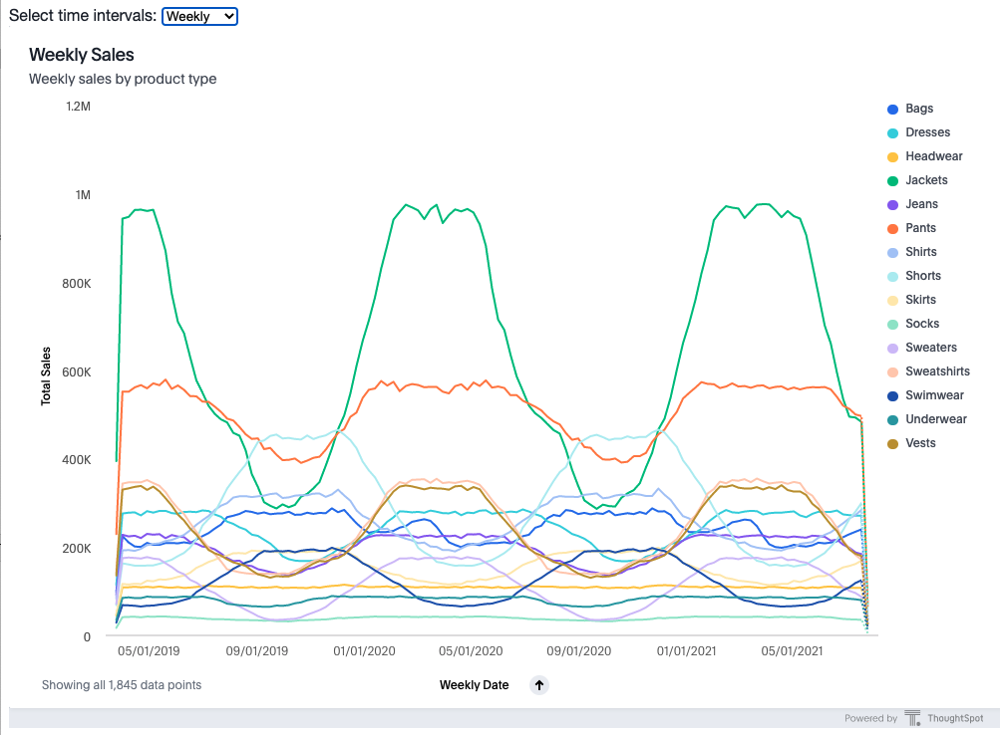
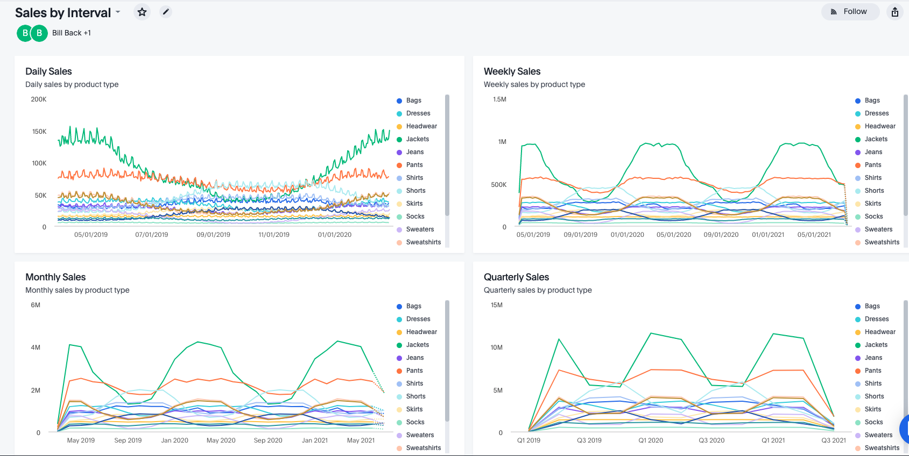

# Select Time Intervals

This example shows how you can add the ability to select different time intervals for embedded visualizations.  ThoughtSpot runtime filters only allow you to specify dates, not different intervals.  This example solves the problem by using a pinboard with multiple visualizations at different time intervals.  Then the user selects the time interval from a dropdown, which causes the time interval to be updated.

## Setup

First, create a pinboard with visualizations at different time intervals like the one shown.

Next, update the visualization IDs in the `<select>` options in `index.html`, e.g.

~~~
<select id="select-visualizations">
    <option value="7e242033-2db1-41e4-ae2c-dd1488019059">Daily</option>
    <option value="8bf42ab8-b9f5-4c0f-aaeb-5cf1d1153ba1">Weekly</option>
    <option value="110edd3d-8215-4d07-a880-b64de81bca89">Monthly</option>
    <option value="87b35e25-fd14-43a7-80de-815939c62e9d">Quarterly</option>
</select>
~~~

Finally, update the vizId to start with in the PinboardEmbed object in tse.js.

`let vizId = "7e242033-2db1-41e4-ae2c-dd1488019059";`

## Solution

In the `embedPinboardViz` function, add the embed component.

~~~
const embedPinboardViz = () => {
  const embed = new PinboardEmbed("#embed", {
    frameParams: { width:"100vw", height:"70vw" },
    pinboardId: "ff942c07-e1b6-4b5d-9d3b-51fac0cd7b8f",
    vizId: vizId,
  });

  embed.render();
}
~~~

Next, create a function to update the pinboard when a new select is chosen:
~~~
const changeViz = () => {
  console.log('changing the visualization');
  vizId = document.getElementById('select-visualizations').value;
  embedPinboardViz();
}
~~~

Finally, associate the new function with the `onchange` event of the selector.

`document.getElementById('select-visualizations').onchange=changeViz;`
